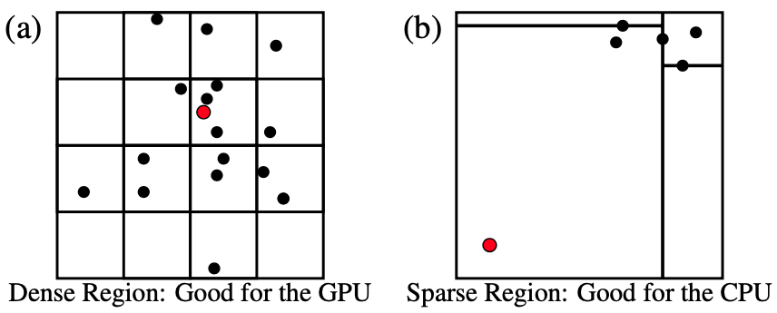
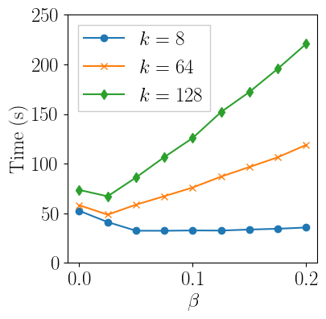

# Update Oct. 6, 2026

**Billion point scale support**

The code has been updated to execute on billion-point scale datasets. 

**New Optimizations**

Added an instruction level parallelism (ILP) optimization that stores partial distances in registers. The optimization is briefly described here: Gowanlock, M., Gallet, B., and Donnelly, B. (2023) "Optimization and Comparison of Coordinate-and Metric-Based Indexes on GPUs for Distance Similarity Searches." International Conference on Computational Science. Cham: Springer Nature Switzerland, 2023.

**Fixes**

Fixed compilation errors with Thrust and CUB that occur due to newer versions of CUDA.

**Implementations**
The Python wrapper around this code has been deprecated and only the C/CUDA code works at present. I plan on updating this in the future.


**Parameters**

When the original paper (below) was published, the GPU employed in the evaluation was an Nvidia GP100 (Pascal generation) with 16 GiB of global memory. As such, $k$NN searches were executed in batches such that the working set does not exceed global memory capacity when the dataset and/or $k$ was sufficiently large. Newer generations of GPUs have additional global memory and so to obtain the best performance with this algorithm, it may be preferable to increase the batch size (parameter GPUBUFFERSIZE). Furthermore, newer generations of GPUs have more compute capacity and so it may be preferable to increase the number of threads assigned to compute the distance calculations for each query point (parameter STATICTHREADSPERPOINT).

A parameter sweep was conducted using the real-world datasets and parameters below using an RTX6000 Pro, which has a compute capability of 12.0 and 96 GiB of global memory. $k=32$ was selected as a nominal value for the small to moderate sized datasets, and $k=4$ was selected for the billion point datasets.

The fixed parameters used to execute the datasets are as follows. We performed a parameter sweep across two parameters on each dataset: GPUBUFFERSIZE and STATICTHREADSPERPOINT.

Observe from the table below that the qualitative dataset sizes are small, moderate, or large, and the dimensionality is low or high, where "high" is 90 dimensional, much larger than in the paper, but certainly not high dimensional in terms of other datasets in the literature (e.g., image descriptor vectors output from neural networks). Also, we note from the table that any dataset exceeding 6 dimensions (GPUNUMDIM) is only indexed in 6 dimensions (NUMINDEXEDDIM) such that index search overhead is not a bottleneck. ILP refers to the optimization that performs pair-wise coordinate distances in registers using instruction level parallelism. It is useful when the data dimensionality is >=4, and the same is true of the SHORTCIRCUIT parameter that aborts computing the distance calculation early if the partial distance exceeds the search radius.


| Dataset | Num. Dimensions | Dataset Size |k|GPUNUMDIM|NUMINDEXEDDIM|ILP|SHORTCIRCUIT|Qualitative Characteristics|
| -------- | --------: | --------: |--------: |--------:|--------:|--------:|--------:|:--------|
| NGSIM    | 2     | 1048574     |  32        | 2|2|0|0|Small dataset size, low dimensionality|
| Ionosphere| 2     | 5159737     |  32       | 2|2|0|0|Moderate dataset size, low dimensionality|
| SuSy    | 18     | 5000000     |  32      | 18|6|4|1|Moderate dataset size, moderate dimensionality|
| Million Song Dataset (MSD)    | 90     | 515345     |  32       | 90|6|4|1|Small dataset size, high dimensionality|
| Gaia DR 2 (ra/dec)    | 2     | 1692919135     |  4       | 2|2|0|0|Large dataset size, low dimensionality|
| Kitti    | 3     | 1000000000     |  4       | 3|3|0|0|Large dataset size, low dimensionality|


Using the experiments above, the following parameters should be employed to achieve good performance on these datasets and others. Depending on what GPU model is used, and the size of the dataset, GPUBUFFERSIZE may need to be decreased to prevent memory allocation errors where there may be insufficient memory capacity to store the result buffer.


|        | Dataset size: Small | Dataset size: Moderate | Dataset size: Large  |
|--------| --------            | --------             | -------- |
| Data Dimensionality: Low     | GPUBUFFERSIZE=50000000 (50M), STATICTHREADSPERPOINT=8     | GPUBUFFERSIZE=100000000 (100M), STATICTHREADSPERPOINT=32     |GPUBUFFERSIZE=500000000 (500M), STATICTHREADSPERPOINT=32     |
| Data Dimensionality: Moderate/High    | GPUBUFFERSIZE=200000000 (200M), STATICTHREADSPERPOINT=128     | GPUBUFFERSIZE=500000000 (500M), STATICTHREADSPERPOINT=128     |GPUBUFFERSIZE=500000000 (500M), STATICTHREADSPERPOINT=128     |


**Future Work**
- Fix the Python wrapper
- Remove batching and switch to unified memory which would improve portability and reduce the number of parameters


# Overview: Hybrid CPU+GPU k-nearest-neighbor self-join algorithm

**Update: Instructions for using the Python wrapper are found at the bottom of the readme.**

This is the GPU *k*-nearest neighbor (KNN) self-join implementation reported in Gowanlock (2021) (paper reference below). The KNN self-join takes as input a dataset, and finds the KNN for all points in the dataset. This algorithm is designed for low to moderate dimensionality (i.e., 2-8 dimensions).

The paper demonstrates a hybrid CPU+GPU KNN self-join algorithm with a workqueue that assigns KNN searches in regions with high density to the GPU and those in low density regions to the CPU. The CPU KNN algorithm in the paper is the Approximate Nearest Neighbors by Mount & Arya, configured to generate the exact neighbors (link below). Although the algorithm was intended for execution on a single computer in a shared-memory environment, the ANN algorithm was parallelized using MPI in Gowanlock (2021) because the sequential ANN source code had several global variables that made shared-memory parallelization very challenging (e.g., race conditions were prevalent), and I was not satisfied with the possibility of non-deterministic bugs, so MPI was used for parallelization. 

The use of MPI made the implementation significantly more complicated, as the code had to accommodate a master-worker model with a distributed-memory workqueue. Thus, to eliminate much of the complexity in the code, and dependencies on MPI and ANN, **this repository only contains the GPU-only algorithm in Gowanlock (2021) and does not require MPI or ANN.**

Since the hybrid CPU+GPU algorithm was designed such that the GPU computes the queries in dense regions, and the CPU computes queries in sparse regions, the GPU algorithm was not designed to compute queries that require large search distances, which occurs when queries are in sparse regions. An illustration of indexing is shown in the figure below. Thus, the performance of the GPU-only algorithm is poor if using a dataset with significant skew. It will perform well on datasets with uniform distributions. In short, this algorithm is **intended for use with another algorithm that can "clean up" those KNN searches in sparsely populated areas** of the data space. Therefore, if you use this algorithm, be conscious of the fact that it may not perform well across all data distributions. The paper shows additional details regarding the GPU-only component of the algorithm.




## Acknowledgements
This material is based upon work supported by the National Science Foundation under Grant No. 1849559.

# References

Paper:
Gowanlock, Michael. "Hybrid KNN-join: Parallel nearest neighbor searches exploiting CPU and GPU architectural features." Journal of Parallel and Distributed Computing 149 (2021): 119-137.
Preprint: https://jan.ucc.nau.edu/mg2745/publications/Gowanlock_JPDC2020.pdf

ANN algorithm: https://www.cs.umd.edu/~mount/ANN/


# Parameter tuning to address the inefficiency described above

The GPU algorithm will search an initial search radius, where a fraction of the query points will have at least *k* nearest neighbors, and some of the queries will fail to find at least *k* nearest neighbors. Based on the fraction of failed queries, the algorithm will increase the search radius, and re-attempt the searches. Thus, the performance of the algorithm depends on the initial and subsequent search distances. 

The algorithm has a parameter, BETA, that can be used to increase the initial search distance. BETA=0 means that on average there are likely to be at least *k* neighbors per query point. BETA=1 will increase the initial search distance, such that on average 100x *k* neighbors are found. Thus, BETA can be tuned in the range [0, 1] to select a value that yields good performance. BETA=0 means that more queries will need to be reattempted, but there will be less wasted work by finding far more than *k* neighbors per query point. A larger value of BETA has the opposite effect, where there will be more wasted work by finding far more than *k* neighbors per query point, but fewer re-attempt iterations will be needed.

As an example, the figure below shows the response time as a function of BETA for *k=8, 64, 128* on the Gaia 25 million point dataset. Observe that 1) larger values of *k* are more sensitive to the paramter; and, 2) A very low value of BETA perfoms well, such as 0.025. This is on a single dataset, and performance will differ on other datasets.





# Parameters

The parameters file, params.h, contains several parameters. The main parameters that you will likely want to change are as follows:

* DTYPE- This is the data type, which can be float or double. Default: float
* GPUNUMDIM- This is the data dimensionality. Default: 2
* NUMINDEXEDDIM- This is the same as above, but could be used to index in fewer dimensions than the above.
* GPUBUFFERSIZE- The result set buffer size that is allocated across 3 GPU streams to overlap data transfers and GPU computation. Depending on the capacity of your GPU, you may want to increase or decrease the size of the buffer. Default: 75000000.

# Executing the algorithm
Update the Makefile to include the compute capability of your Nvidia GPU, and compile using the Makefile.

On the command line, the algorithm takes as input the dataset file \<FNAME\>, the dataset size \<DATASET SIZE\>,  the dimensionality of the data \<DIM\>, and the value for *k* \<K\>. The program is executed as follows:

```
$./main <FNAME> <DATASET SIZE> <DIM> <K>
```

By default, the algorithm will output the neighbors to a file called "KNN_out.txt", which contains the point ID and all of its neighbors. The code can be modified to incorporate the KNN into other applications such that printing to a file is unnecessary.
  
# Example data and validation
The data file gaia_dr2_ra_dec_25M.txt is the Gaia dataset in the paper. It can be found here: https://rcdata.nau.edu/gowanlock_lab/datasets/hybrid_KNN/gaia_25M.tar.gz
For validation purposes, the program will output the sum of the distances between all points and their *k* nearest neighbors. As an example, the total unsquared distance for k=128 on the Gaia dataset is below. This can be used to ensure that your implementation is working correctly.

[Verification] Total distance (without square root): 23999187.187628

# Python Interface
A Python interface has been provided that uses a shared library to access the C/CUDA code. 

To use the Python interface, edit the makefile with your settings and compile the shared library using the Makefile target as follows:
$make make_python_shared_lib

The settings that you will need to update are:
* The desired data dimensionality and number of indexed dimensions.
* The compute capability of your GPU.
* Any changes to the params.h file (described above). It is unlikely that you will need to change any parameters, although one common change might be to use doubles instead of floats.

After compiling the shared library, you can use the Python interface, where knnjoingpu.py is Python wrapper around the C/CUDA code, and KNNJoin_test_example.py shows an example of using the library.

The interface returns the list of K nearest neighbors for each point in the dataset, and the distances to the neighbors.

The interface is below:
neighborTable, neighborTableDistances = knnjoingpu.knnjoin(dataset, KNN, numdim, dtype, verbose)

After running the program using the dataset described above with K=5, you should see the following output, which shows the k-NN for the first and last point in the dataset and the corresponding distances.

[    0  2135 13737 11757 11939  3897]

[24999999 24996797 24995960 24988992 24996019 24995882]

[0.         0.01367115 0.01500092 0.01559466 0.0169069  0.01747429]

[0.         0.01285255 0.0454131  0.05056508 0.05199444 0.05496496]

